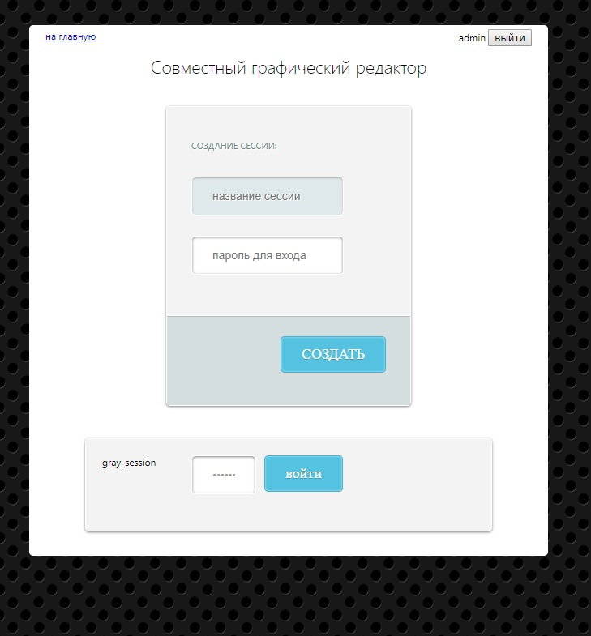
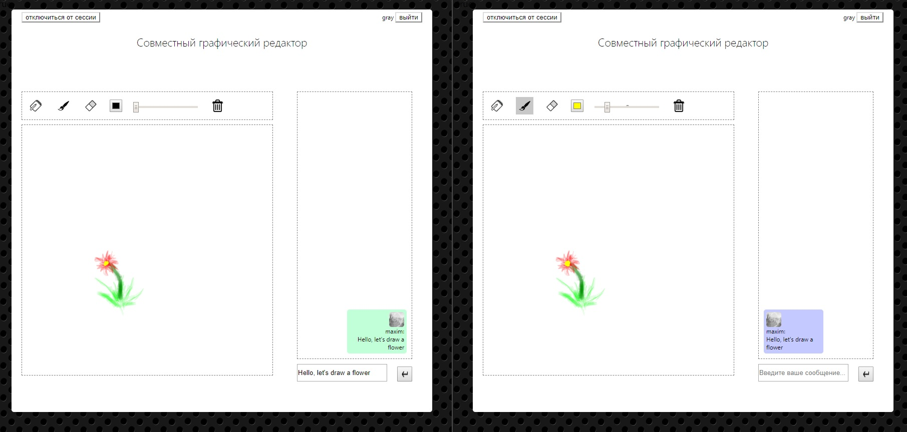

# Paint Online

Графический онлайн редактор с совместным рисованием на одном полотне.
Стек технологий:
1. PHP
2. WebSocket
3. JavaScript
4. MySql

### Запуск
1. Инициализировать базу MySql [следующим скриптом](readme/paint.sql). Назвать её "**paint**" и захостить на localhost:3306
2. Установить пакеты composer (composer install) и обновить автозагрузку классов (composer dump-autoload)
3. Запустить [этот сокет](php/runSocket.php) через php, отредактировав [файл](run_websocket_server.bat)
4. Запустить php сервер для сайта

### Пример работы

| | |
| :--- | ---: |
|  |  |

||
| :---: |
|  |